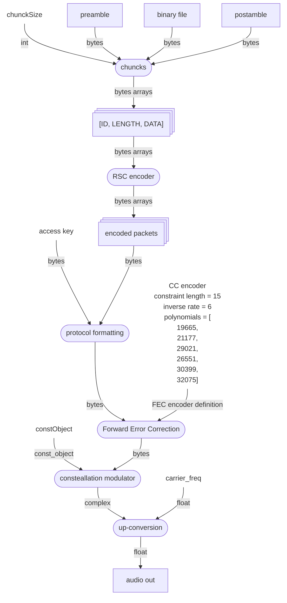
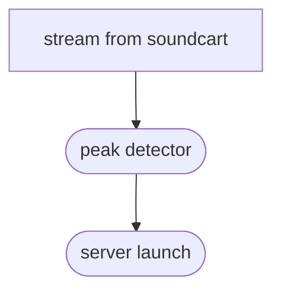
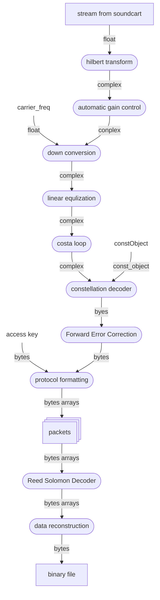

# transmitter

```mermaid
flowchart TD
    binary[binary file]
    chunckSize@{shape: text}
    chuncks([chuncks])
    packet@{shape: procs, label: "[ID, LENGTH, DATA]"}
    encoder([RSC encoder])
    encoded_packet@{shape: procs, label: "encoded packets"}
    protocol([protocol formatting])
    access@{shape: text, label: access key}
    FEC([Forward Error Correction])

    CCencoder["`CC encoder
    constraint length = 15
    inverse rate = 6
    polynomials = [
        19665,
        21177,
        29021,
        26551,
        30399,
        32075]`"]
    CCencoder@{shape: text}

    constObject@{shape: text}
    const_mod([consteallation modulator])
    carrier_freq@{shape: text}
    upconvert([up-conversion])
    audio[audio out]

    chunckSize -- int --> chuncks
    preamble -- bytes --> chuncks
    binary -- bytes --> chuncks
    postamble -- bytes --> chuncks
    chuncks -- bytes arrays --> packet
    packet -- bytes arrays --> encoder
    encoder -- bytes arrays --> encoded_packet
    access -- bytes --> protocol
    encoded_packet -- bytes --> protocol
    protocol -- bytes --> FEC
    constObject -- const_object --> const_mod
    CCencoder -- FEC encoder definition --> FEC
    FEC -- bytes --> const_mod
    const_mod -- complex --> upconvert
    carrier_freq -- float --> upconvert
    upconvert -- float --> audio
```
 
# listenning

```mermaid
flowchart TD
    stream[stream from soundcart]
    peak([peak detector])
    server([server launch])

    stream --> peak
    peak --> server
```

# receiver

```mermaid
flowchart TD
    stream[stream from soundcart]
    toComplex([hilbert transform])
    AGC([automatic gain control])
    carrier_freq@{shape: text}
    downConvert([down conversion])
    linearEQ([linear equlization])
    costaL([costa loop])
    constObject@{shape: text}
    constDecoder([constellation decoder])
    FEC([Forward Error Correction])
    protocol([protocol formatting])
    access@{shape: text, label: access key}
    packets@{shape: procs}
    RSD([Reed Solomon Decoder])
    dataReconstrut([data reconstruction])
    binary[binary file]

    stream -- float --> toComplex
    toComplex -- complex --> AGC
    carrier_freq -- float --> downConvert
    AGC -- conplex --> downConvert
    downConvert -- complex --> linearEQ
    linearEQ -- complex --> costaL
    costaL -- complex --> constDecoder
    constObject -- const_object --> constDecoder
    constDecoder -- byes --> FEC
    access -- bytes --> protocol
    FEC -- bytes --> protocol
    protocol -- bytes arrays --> packets
    packets  -- bytes arrays --> RSD
    RSD   -- bytes arrays --> dataReconstrut
    dataReconstrut -- bytes --> binary
```
